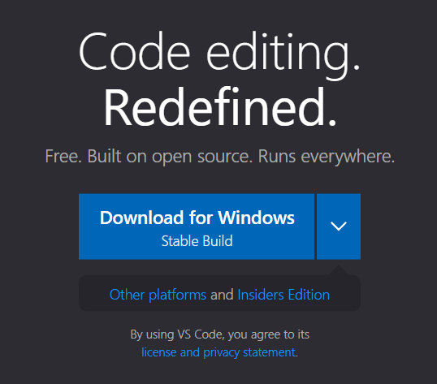
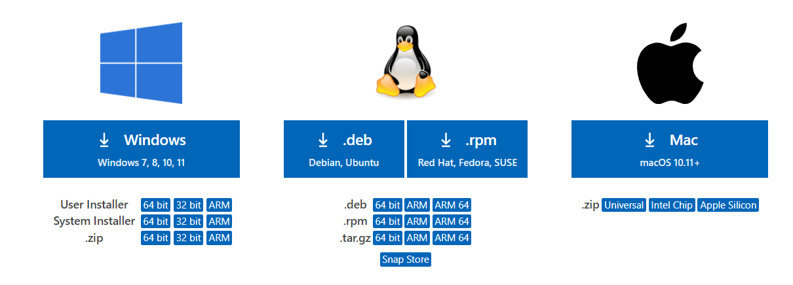
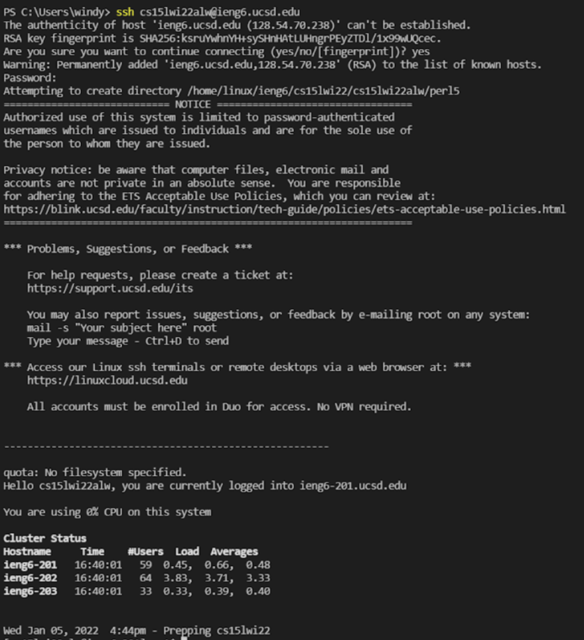
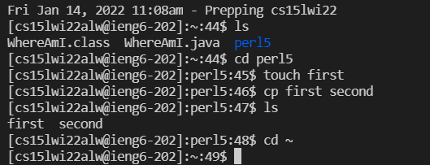
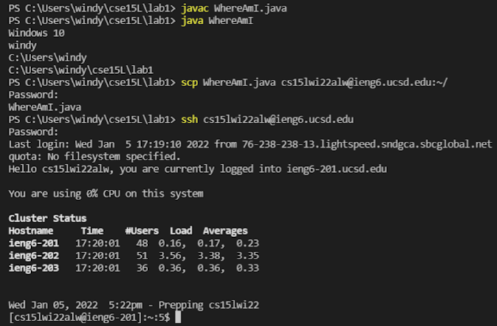
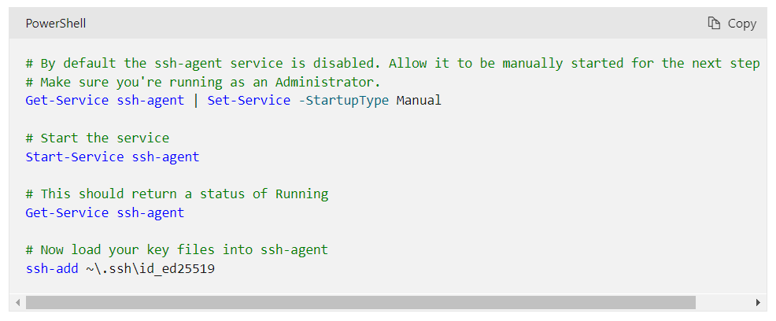
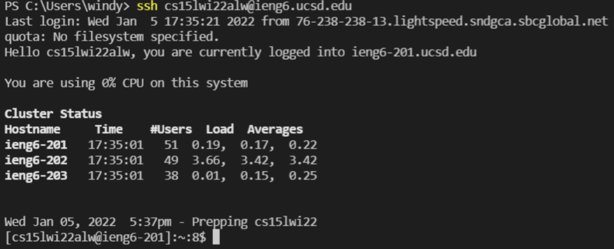
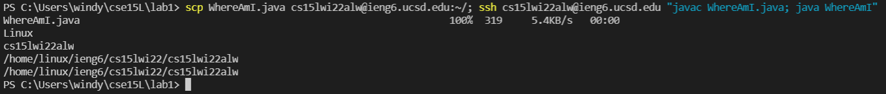

# Week 2 Lab Report (Tutorial for Logging into ieng6)

## Installing VScode
If you already have VScode you can skip this step. If not, use the link [Visual Studio Code](https://code.visualstudio.com/) to download VScode onto your computer. 
If you have Windows, use the button in this photo.


If you have a Mac or want to use a different version, scroll to the bottom and use this:


## Remotely Connecting
First install OpenSSH using the link [OpenSSH](https://docs.microsoft.com/en-us/windows-server/administration/openssh/openssh_install_firstuse) and follow the instructions on the site. Then your your course-specific account for CSE15L using [sdacs.ucsd.edu](https://sdacs.ucsd.edu/~icc/index.php). When you do this for the first you will need to reset your password. Make sure not to switch your password for TritonLink along with it. If you get stuck when typing your new password, push enter instead of clicking the button on the website.

---

Now you want to open VScode and open the terminal in the top left bar. Type the command 
```
ssh cs15lwi22alw@ieng6.ucsd.edu
```
but replace "cs15lwi22alw@ieng6.ucsd.edu" with your own account. It should look very similar besides the "alw". The first time you try to use this, they will ask if you want to continue connecting and you should type "yes". Afterwards you should input your password. As you are typing the letters won't show up on you screen, but there are being inputed into your computer so push enter when you finish typing. When you are done it should like this:



## Trying Some Commands
- `cd ~`  Navigate to the user’s home directory
- `cd` Change Directory
- `ls`	Show directory contents (list the names of files)
- `cat`	Show contents of a file.
- `cp`	Copy file/folder of first arugument to second
- `touch` Create a new file
- `rm` Removes a file

Here are some examples of how to use them


After you are done you can log out of your server by pressing Ctrl-d or typing "exit"
## Moving Files with scp
The command `scp` is used to put files on your computer to a remote computer. You do this by making any file you want then typing
```
scp WhereAmI.java cs15lwi22alw@ieng6.ucsd.edu:~/
```
while you are logged out of ssh. Replace WhereAmI.java with your own file name and the account with your own account name.

## Setting an SSH Key
An SSH Key is used so that you don't to keep retyping your password in when running ssh or scp. You do this by typing
```
ssh-keygen
```
When they ask you
```
Enter file in which to save the key (C:\Users\windy/.ssh/id_rsa)
```
You can copy and paste and line inside of the parenthesis they give you so in this case it would be `C:\Users\windy/.ssh/id_rsa`
Then you will be asked to input your passphrase twice. If you have a windows there is an extra step where you go to the website, [sshKey](https://docs.microsoft.com/en-us/windows-server/administration/openssh/openssh_keymanagement#user-key-generation), and scroll down for the commands to ssh-add. It should look like 

You want to run the 4 lines of code into your Powershell on your computer. Make sure to run as Administrator when you open your Powershell.

In order to copy the public key to the `.ssh` directory follow the commands

`ssh cs15lwi22alw@ieng6.ucsd.edu`

`mkdir .ssh`

Then logout of ssh and type

`scp C:\Users\windy/.ssh/id_rsa cs15lwi22alw@ieng6.ucsd.edu:~/.ssh/authorized_keys`

but replace it with your path and account.
Afterwards, you won't need to input your password and it should look like this

## Optimizing Remote Running
Now we want to try to speed up our commands. So if we want to make our local edits move onto a remote server, we can combine each line with a semicolon. For example:

Do this but replace the account with yours, and put the file that you edited.

