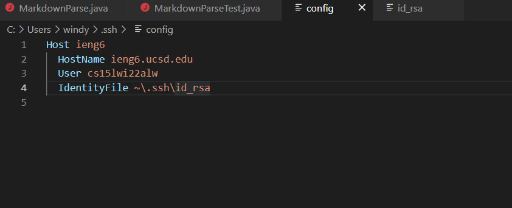
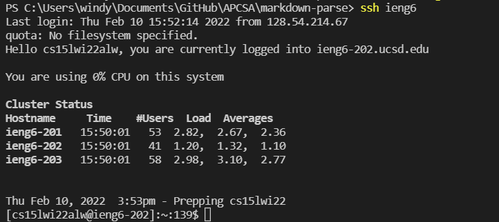
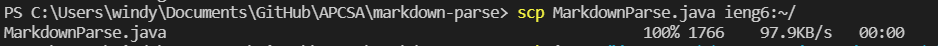

# Week 6 Lab Report (Streamlining ssh Configuration)
##  Configuration Files

---

I configured the files for ssh by using the command
```
~/.ssh/config
```
I opened this file in vscode and removed the .ucsd.edu on the first line. I also added `IdentityFile ~/.ssh/id_rsa` to the last line of my configure file
I ended up with this:


## SSH Login

---

After doing that, I was able to quickly login to my ssh by just typing out this:


## Copying Files with scp

---

With this short cut, I was able to copy my MarkdownParse files into my account through these lines
