# Week 8 Lab Report
## Links to Repositories
[My Repository](https://github.com/c5du/markdown-parse)

[Reviewed Repository](https://github.com/annakkin/markdown-parse)
## Snippet 1


---

```
`[a link`](url.com)

[another link](`google.com)`

[`cod[e`](google.com)

[`code]`](ucsd.edu)
```
The common mark demo site gave back this:

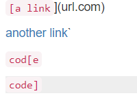

The last 3 lines contained links to the ones inside the parenthesis.

The 1st usable link led to `%60google.com`

The 2nd link led to `google.com`

The 3rd link led to `ucsd.edu`

I tested this file by using:
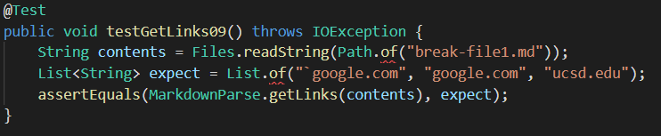

For my markdownParse, I got back this:
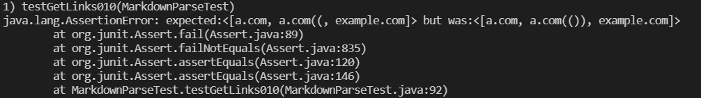

For the reviewed markdownParse, I got back this:
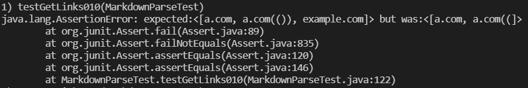

## Snippet 2


---

```
[a [nested link](a.com)](b.com)

[a nested parenthesized url](a.com(()))

[some escaped \[ brackets \]](example.com)
```
Common mark demo site:

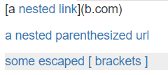

The first link led to `a.com`

The 2nd link led to `a.com(())`

The 3rd link led to `example.com`

I tested this file by using:
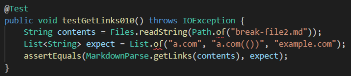

For my markdownParse, I got back this:
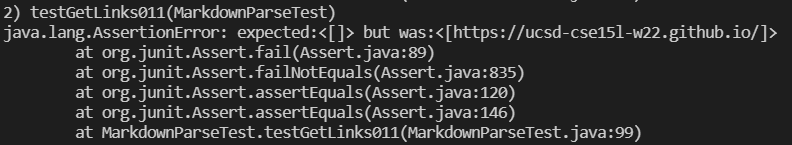

For the reviewed markdownParse, I got back this:
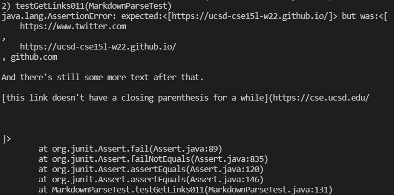

## Snippet 3


---

```
[this title text is really long and takes up more than 
one line

and has some line breaks](
    https://www.twitter.com
)

[this title text is really long and takes up more than 
one line](
    https://ucsd-cse15l-w22.github.io/
)


[this link doesn't have a closing parenthesis](github.com

And there's still some more text after that.

[this link doesn't have a closing parenthesis for a while](https://cse.ucsd.edu/


)

And then there's more text
```
Common Mark demo site:

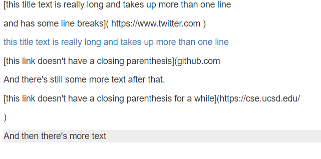

There was only 1 link in the middle which led to `https://ucsd-cse15l-w22.github.io/`

I tested this file by using:
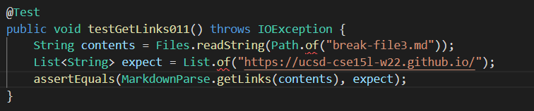

For my markdownParse, I got back this:
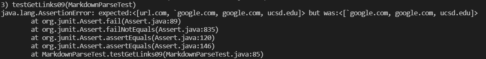

For the reviewed markdownParse, I got back this:
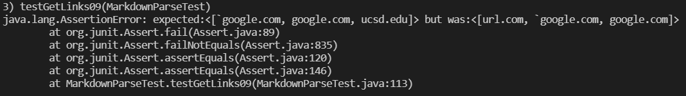

## Questions


---

**Do you think there is a small (<10 lines) code change that will make your program work for snippet 1 and all related cases that use inline code with backticks? If yes, describe the code change. If not, describe why it would be a more involved change.**

Yes, I think that a fix to this bug could be really short. The code change would involve checking for backticks outside of the brackets and parenthesis. Once you know where they are, you shouldn't account for anything inside of them

**Do you think there is a small (<10 lines) code change that will make your program work for snippet 2 and all related cases that nest parentheses, brackets, and escaped brackets? If yes, describe the code change. If not, describe why it would be a more involved change.**

Yes, I think the fix to snippet 2 would also be pretty short, but longer than snippet 1. The code change would involve checking for links inside of links, making cure each parenthesis is closed when there are multiple, and making sure markdownParse knows what an escaped bracket is so that they are not considered brackets of websites.

**Do you think there is a small (<10 lines) code change that will make your program work for snippet 3 and all related cases that have newlines in brackets and parentheses? If yes, describe the code change. If not, describe why it would be a more involved change.**

Yes, the fix to snippet 3 would probably be short too. The code change would include checking for newlines, then you would have to check in they were in the brackets, or the parenthesis. Additionally, you have to check if how many newlines there were so that would also result in it not becoming a website.