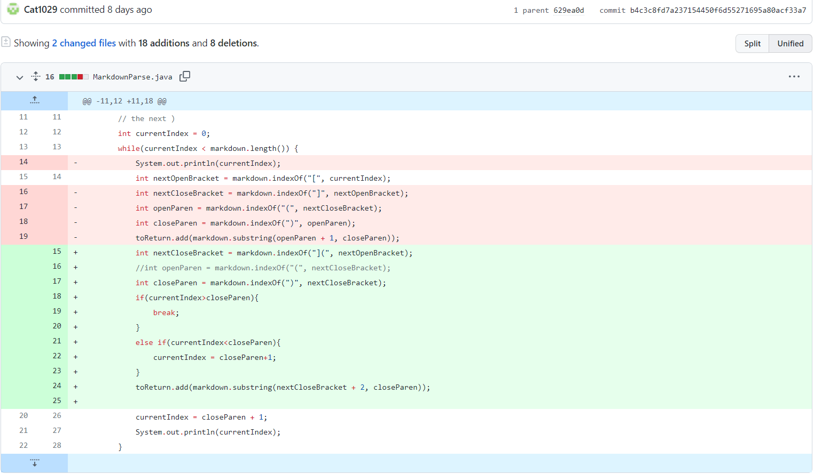

# Week 4 Lab Report (Fixing bugs in code)
## First Bug

---

This first bug we had during the 3rd lab was this:

The value 73 that is printed in the terminal was the `currentIndex`. When the was a closed parenthesis before the website link, our code would get stuck in an infinite loop. We fixed this by doing this:

We added an if statement to check if the current index was greater than the closed parenthesis. Another error we fixed in this same edit was combining the closed bracket and open parenthesis together to make sure that they were connected.

## Second Bug

---

The output and file of the second bug was this:

Since there is an exclamation mark before the open bracket, it follows the format for a photo, however the code we had though the page.com was a link to print out. We fixed the bug by doing this:

For the fix we searched for `![` and made it a new variable. Later we checked if that index was was the same as the index of `nextOpenBracket-1`, and if it was the code would break. This would make sure that if there is a photo formated link instead of a website, it won't be returned. However there are a few flaws to this fix so we changed it later.

## Third Bug

---

The last bug we found was this:

The closed parenthesis was infront of the open bracket so an IndexOutOfBounds error was given. One of my teammates fixed this by doing this:

We removed the previous changes we added since they made a lot of variables and were specifically targeted towards that one test file. We made sure to check for `!]` and `!](` and added values to the indexs to make sure they matched. At the bottom I also add the check for spaces since I had forgotten to put that in.

